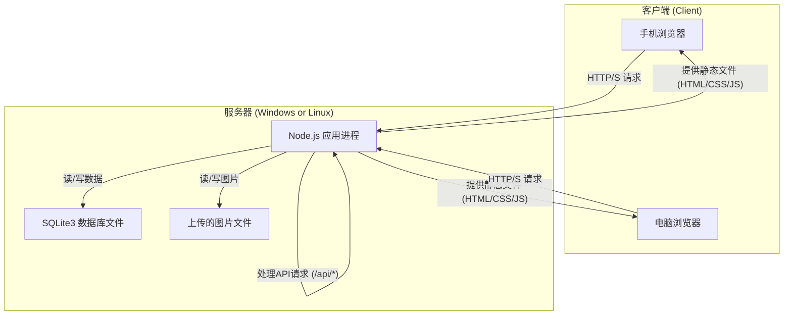

# 消防器材点检管理系统 - 系统架构文档 (Architecture.md)

## 1. 概述 (Overview)

本文档旨在定义“消防器材点检管理系统”的技术架构。基于产品需求文档(PRD)，本系统将采用**前后端集成部署**的模式。

在此模式下，后端 **Node.js 服务器** 将承担双重职责：
1.  **提供API服务**：处理所有业务逻辑、数据读写和用户认证。
2.  **托管前端应用**：直接向用户的浏览器提供构建好的前端静态文件（HTML, CSS, JavaScript）。

这种模式简化了部署和运维，因为只需要管理一个服务进程，无需配置反向代理（如Nginx），非常适合在Windows和Linux环境下直接运行。

### 1.1 架构总览图



## 2. 技术选型 (Technology Stack)

| 类别 | 技术 | 备注 |
| :--- | :--- | :--- |
| **前端框架** | **React (Vite)** | 推荐使用 Vite + React，因为它构建速度快，配置简单。 |
| **前端UI库** | **shadcn/ui** | 基于Tailwind CSS和Radix UI，提供高质量、可定制的UI组件。 |
| **前端HTTP客户端** | Axios 或 Fetch API | 用于与后端API进行数据交互。 |
| **后端框架** | **Node.js + Express.js** | 成熟稳定的Node.js Web框架，内置强大的中间件生态，能轻松处理API和静态文件。 |
| **数据库** | **SQLite3** | 轻量级文件数据库，内嵌在应用中，无需独立服务。 |
| **ORM** | **Prisma** | 强烈推荐。提供类型安全，并极大简化从SQLite到其他数据库的未来迁移工作。 |
| **认证方案** | **JWT (JSON Web Tokens)** | 无状态认证机制，适合前后端分离开发、集成部署的模式。 |
| **进程管理器** | **PM2** | **强烈推荐**用于生产环境。它能守护Node.js进程，实现崩溃后自动重启、日志管理、性能监控和多核负载均衡，支持Windows和Linux。 |

## 3. 架构设计

### 3.1 前端应用设计 (Frontend Application Design)

1.  **项目初始化**: 使用 `npm create vite@latest` 初始化项目骨架。
2.  **UI构建**: 遵循 `shadcn/ui` 的官方文档，按需引入和定制组件，如表单(Form)、表格(Data Table)、对话框(Dialog)等，用于电脑端的数据展示和管理界面。
3.  **移动端适配**: 采用响应式设计（Responsive Design），利用Tailwind CSS的响应式断点工具（如 `md:`, `lg:`），确保同一套代码在手机和电脑浏览器上都有良好的显示效果。
4.  **状态管理**: 对于简单的跨组件状态共享，可使用React Context。对于复杂的全局状态，可引入轻量级的状态管理库如 Zustand 或 Jotai。
5.  **核心流程**:
    *   **登录页**: 用户输入账号密码，点击登录后调用后端 `/api/auth/login` 接口。
    *   **获取Token**: 登录成功后，从后端获取JWT，并将其存储在浏览器的 `localStorage` 或 `sessionStorage` 中。
    *   **API请求**: 后续所有对后端API的请求，都在请求头（Header）中附带 `Authorization: Bearer <JWT>`。
    *   **扫码页(移动端)**: 使用 `html5-qrcode` 或类似库，实现前端的扫码功能。扫描成功后，获取器材ID，跳转到点检详情页 `/inspection/[id]`。

### 3.2 后端应用设计 (Backend Application Design)

1.  **API设计**: 设计遵循 **RESTful** 规范。使用名词表示资源，HTTP动词表示操作。
    *   `POST /api/auth/login` - 用户登录
    *   `GET /api/equipments` - 获取器材列表（支持分页、筛选）
    *   `GET /api/equipments/:id` - 获取单个器材详情
    *   `POST /api/inspections` - 提交新的点检记录
    *   `GET /api/issues` - 获取隐患列表
    *   `PUT /api/issues/:id/handle` - 提交隐患处理结果
    *   `PUT /api/issues/:id/audit` - 审核隐患处理
2.  **项目结构**: 采用分层结构，清晰地分离关注点。
    *   `routes/` - 定义API路由
    *   `controllers/` - 处理HTTP请求，调用服务层，返回响应
    *   `services/` - 封装核心业务逻辑
    *   `middlewares/` - 中间件，如JWT认证、错误处理
    *   `prisma/` - 数据库模型和迁移文件
3.  **认证中间件**: 创建一个 `authMiddleware`，用于保护需要登录才能访问的API路由。它会校验请求头中的JWT是否有效，无效则返回401 Unauthorized。
4.  **数据处理**: 所有数据库操作都通过Prisma进行，严禁直接拼接SQL字符串，以从根本上防止SQL注入。
5.  **文件上传**: 点检照片和问题照片的处理，使用 `multer` 等中间件。图片可以存储在服务器的指定目录中（如 `uploads/`），并在数据库中保存其相对路径。

### 3.3 服务器集成与配置 (Server Integration)

后端Express服务器通过特定配置，同时承担API服务和静态文件托管的职责。

**Express服务器配置示例 (`server.js`)**
```javascript
const express = require('express');
const path = require('path');
const apiRoutes = require('./src/routes'); // 引入所有API路由

const app = express();
const PORT = process.env.PORT || 3001;

// 1. 中间件：处理JSON请求体和URL编码数据
app.use(express.json());
app.use(express.urlencoded({ extended: true }));

// 2. 静态文件服务: 托管构建好的前端应用和上传的图片
app.use(express.static(path.join(__dirname, 'public')));
app.use('/uploads', express.static(path.join(__dirname, 'uploads')));

// 3. API 路由: 所有 /api 的请求都由 apiRoutes 处理
app.use('/api', apiRoutes);

// 4. “全匹配”路由 (Catch-all Route): 处理所有非API、非静态文件的请求
//    这对于使用客户端路由（如React Router）的单页应用(SPA)至关重要。
//    它确保用户在浏览器中直接访问 /dashboard 或刷新页面时，应用能正确加载。
app.get('*', (req, res) => {
  res.sendFile(path.join(__dirname, 'public', 'index.html'));
});

// 启动服务器
app.listen(PORT, () => {
  console.log(`Server is running on http://localhost:${PORT}`);
});```

## 4. 部署流程 (Deployment)

在目标服务器（Windows 或 Linux）上部署应用的步骤如下：

### 4.1 环境准备
1.  安装 **Node.js** (推荐LTS版本)。
2.  安装 **Git** 用于拉取代码。
3.  全局安装 **PM2**: `npm install pm2 -g`。

### 4.2 部署步骤
1.  **获取代码**:
    ```bash
    git clone [your-repository-url].git
    cd fire-safety-system
    ```
2.  **安装后端依赖**:
    ```bash
    cd backend
    npm install
    ```
3.  **构建前端**:
    ```bash
    cd ../frontend
    npm install
    npm run build
    ```
4.  **拷贝静态文件**: 将 `frontend/dist` 目录下的所有文件，拷贝到 `backend/public` 目录下。
5.  **创建数据和上传目录**: 在 `backend` 目录下手动创建 `data` 和 `uploads` 两个文件夹。
6.  **配置环境变量**: 在 `backend` 目录下创建一个 `.env` 文件。
    ```env
    PORT=3001
    DATABASE_URL="file:./data/prod.db"
    JWT_SECRET="a-very-strong-and-long-secret-key-for-production"
    ```
7.  **启动应用 (使用PM2)**:
    在 `backend` 目录下执行：
    ```bash
    pm2 start server.js --name "fire-safety-app"
    ```
8.  **设置开机自启**:
    ```bash
    pm2 startup
    # 根据提示，复制并执行生成的那行命令
    pm2 save
    ```

## 5. 目录结构建议

```
fire-safety-system/
├── backend/                  # 后端项目
│   ├── data/                 # 存放SQLite数据库文件
│   ├── public/               # 存放构建好的前端文件 (从 frontend/dist 复制而来)
│   ├── uploads/              # 存放用户上传的图片
│   ├── src/
│   │   ├── controllers/
│   │   ├── middlewares/
│   │   ├── routes/
│   │   └── services/
│   ├── .env                  # 环境变量
│   ├── package.json
│   └── server.js             # Express 入口文件
└── frontend/                 # 前端项目
    ├── public/
    ├── src/
    ├── package.json
    └── vite.config.js
```